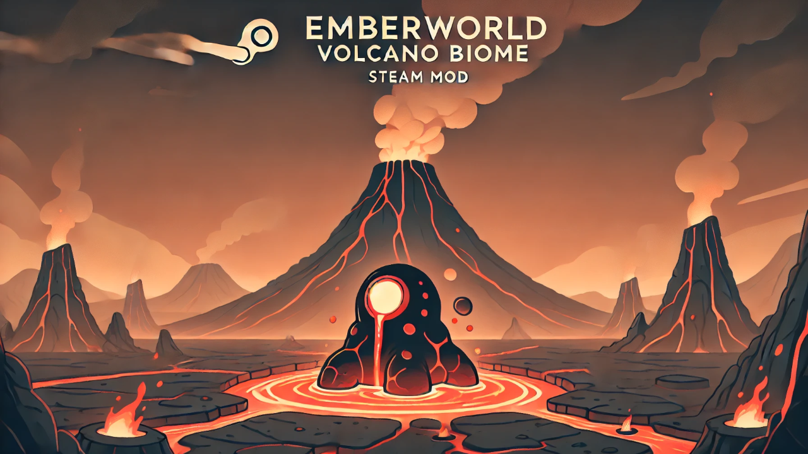

# Emberwild Biome Mod for RimWorld 1.5

*Survive and thrive in the searing heat of the Emberwild Biome!*

---

## Status

**This project is in ALPHA** and isn't released on to the Steam Workshop yet. I hope that it will be available soon! :)

---

## Overview

**Emberwild Biome** is a mod for **RimWorld 1.5** that introduces a new, challenging environment inspired by volcanic activity and extreme heat. This biome pushes your survival skills to the limit with scorching temperatures ranging from **90°F to 150°F**, dynamic volcanic landscapes, and unique flora and fauna adapted to the fiery conditions.

---

## Features

### 🔥 Extreme Temperatures

- **Scorching Heat:** Temperatures range from **90°C to 150°C**, requiring innovative cooling solutions.
- **Heat Management:** Utilize heat-resistant gear and building materials to keep your colonists safe.

### 🌋 Volcanic Terrain

- **Active and Dormant Volcanoes:** Adds both beauty and danger to your colony's surroundings.
- **Lava Flows:** Static rivers of lava replace traditional rivers, posing constant threats.
- **Craters and Steam Geysers:** Enhanced hazardous landscape, but at a reward of more steam geysers than normal.
- **Abundant Slate:** Slate spawns frequently, especially around volcanoes.

### ⛅ Unique Weather Events

- **Ash Rain:** Reduces visibility and affects crop growth.
- **Acid Rain:** Damages structures and harms unprotected colonists.
- **Meteor Showers:** Offer rare minerals but pose risks to your colony.
- **Heatwaves:** More intense than in other biomes, pushing survival skills to the limit.
- **Steam storms**: Steamy hot fog that effects map visibility, makes colonists feel uncomfortable, and has a unique effect on machinery.

### 🌱 Heat-Resistant Flora

- **Ashwood Trees:** Provide fire-resistant wood for building and crafting.
- **Fire Peppers:** Spicy crops that create meals offering temporary heat resistance.
- **Cinder Blooms:** Rare plants used for crafting unique medicines.
- **Flame Vines:** Glow with inner heat, useful for low-lighting or crafting materials.

### 🦎 Adapted Fauna

- **Pyroclast Beasts:** Magma beasts that are mostly dormant, absort a lot of heat, can breathe fire, and mostly wanders taking cat naps in the lava.
- **Magma Cubes:** Small cube like creatures that are deadly in swarms.
- **Lavalopes and lava rats** that are mutated lava-resistant creatures that drink water or lava, and produce lava on it's back sacks

### 🛠️ New Resources & Machines

- **Geothermal Crystals:** Rare materials for advanced technology or trade.
- **Lava harvester:** A big mining rig that collects lava
- **Lava tanks:** A big container for storing the lava in, and can be sold/traded as lava buckets
- **Lava generators:** Machines that generate power from the lava's heat when lava is pumped in

### ⚠️ Environmental Hazards

- **Lava Flows:** Static lava rivers that pose constant threats.
- **Toxic Gas Emissions:** Areas requiring gas masks or sealed environments.
- **Intense Heatwaves:** Challenge your colony's resilience.
- **Lava rising:** lava may rise as an event when the volcano begins to erupt!

### 🛐 New ideology faction
- **Magma cultists:** A group that worships the volcanoes and may be friendly or hostile depending on interactions.

---

## Installation

### Steam Workshop

1. **Subscribe** to the mod on the [Steam Workshop](#).
2. **Launch RimWorld** and go to the **Mods** menu.
3. **Enable** the **Emberwild Biome** mod.
4. **Restart the game** if prompted.

### Manual Installation

1. **Download** the latest release from the [GitHub Releases](#) page.
2. **Extract** the contents to your RimWorld `Mods` folder:
   - **Windows:** `C:\Program Files (x86)\Steam\steamapps\common\RimWorld\Mods`
   - **Mac:** `/Applications/RimWorld.app/Mods`
   - **Linux:** `~/.steam/steam/steamapps/common/RimWorld/Mods`
3. **Launch RimWorld** and go to the **Mods** menu.
4. **Enable** the **Emberwild Biome** mod.
5. **Restart the game** if prompted.

---

## Compatibility

- **RimWorld Version:** Compatible with RimWorld 1.5.
- **Mod Conflicts:** Should be compatible with most mods that do not extensively alter biome generation.
- **Known Issues:** [Report issues](#) if you encounter any problems.

---

## Feedback and Support

- **Bug Reports:** Please report any issues on the [GitHub Issues](#) page.
- **Suggestions:** We're open to new ideas for features or improvements.
- **Community Discussions:** Join our [Discord Server](#) to share your experiences and strategies.

---

## Credits

- **Mod Author:** Alex Navarro (@NavarroTech)
- **Contributors:** TBD
- **Special Thanks:** To Tynan for the epic base game and to the RimWorld community for inspiration and support.

---

## License

This project is licensed under the **Creative Commons Attribution-NonCommercial-ShareAlike 4.0 International License**. You are free to:

- **Share:** Copy and redistribute the material in any medium or format.
- **Adapt:** Remix, transform, and build upon the material.

**Under the following terms:**

- **Attribution:** Give appropriate credit and indicate if changes were made.
- **Non-Commercial:** You may not use the material for commercial purposes.
- **ShareAlike:** Distribute your contributions under the same license.

For the full license text, visit [Creative Commons License](https://creativecommons.org/licenses/by-nc-sa/4.0/).

---

## Contact

- **GitHub:** [NavarroTech](https://github.com/navarrotech)
- **Email:** [alex@navarrotech.net](mailto:alex@navarrotech.net)

---

## Screenshots

[TODO]

---

*Prepare your colony for an unforgiving environment where only the adaptable survive. Harness the power of the volcanoes, utilize the unique resources, and beware of the lurking dangers in the Emberwild Biome!*
